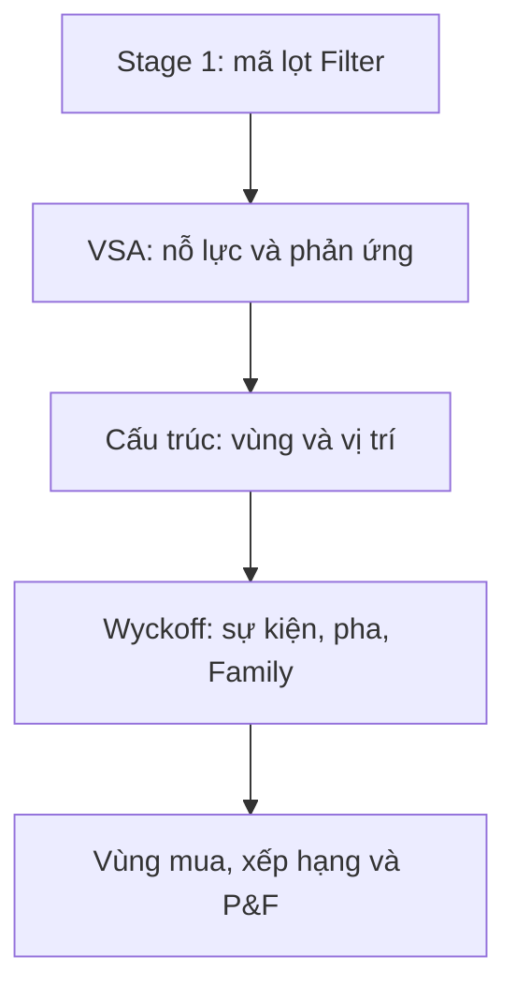

# 13. Truy nguyên và kết hợp kết quả

Bộ lọc được thiết kế theo tầng. Cách đọc an toàn nhất là đi từ điều kiện nền tới mục tiêu, không đi ngược từ một con số hấp dẫn để hợp thức hóa setup.



## 1. Quan hệ nguồn → kết quả

| Kết quả cần giải thích | Nguồn trực tiếp | Cột chẩn đoán |
|---|---|---|
| Trạng thái khối lượng | RVOL | 7–8, 49 |
| Trạng thái biên độ | RSpread | 17, 46 |
| Nỗ lực/kết quả | RVOL + tiến triển/ATR | 20, 47 |
| Vùng cấu trúc | Pivot + bằng chứng hành vi | 64–69 |
| Phase C | Spring/Test hoặc Upthrust/LPSY và phản ứng | 70–74 |
| Phase D | SOS/LPS hoặc SOW/LPSY | 75–78 |
| Evidence/Family | Chuỗi bằng chứng tăng và giảm | 50–80 |
| Cơ hội mua | Family tăng + pha + sự kiện còn mới | 28, 70–82 |
| Vùng mua | Setup + Range + ATR + thanh gốc | 30–32 |
| Ưu tiên | Nhóm giá + độ gần + độ mới | 29, 33 |
| Mục tiêu P&F | Setup + khoảng đếm + Box + Reversal | 34–39, 83–87 |

## 2. Quy trình truy nguyên một dòng

### Bước 1 — Xác nhận dòng có thực sự qua Stage 1

Đọc cột 10–16 rồi đối chiếu Parameters:

- độ dốc MA nào được yêu cầu;
- thứ tự MA có bật không;
- giá so MA20 có trong khoảng không;
- thanh khoản và BBW có đạt không.

Ở chế độ Phân tích, `Cổng VSA = 1` xác nhận Stage 2 đã được phép chạy.

### Bước 2 — Kiểm tra độ sẵn sàng

Các cổng nên được đọc theo thứ tự:

```text
VSA lõi → Hành vi → Cấu trúc → Sự kiện → Phân tích cuối
```

Một cổng bằng `0` có thể giải thích tại sao các tầng phía sau thiếu dữ liệu hoặc không áp dụng. Không biến `0` thành “không có tín hiệu”; đó là “chưa đủ điều kiện để đánh giá”.

### Bước 3 — Tìm bằng chứng gốc

Nếu Summary ghi `CHỈ TĂNG`, hãy tìm ít nhất một nguồn như:

- No Supply đã xác nhận;
- stopping volume có phản ứng giữ đáy;
- Spring hoặc Supply Test xác nhận;
- SOS/LPS;
- hấp thụ có phản ứng tăng.

Nếu Summary ghi `HỖN HỢP`, tìm cả bằng chứng tăng lẫn giảm. AFL cố ý không tự xóa bằng chứng trái chiều để tạo kết quả đẹp hơn.

### Bước 4 — Đặt bằng chứng vào đúng vùng

Kiểm tra cận dưới, cận trên, tuổi vùng, phía hình thành và xu hướng trước. Một Spring chỉ có ý nghĩa cấu trúc khi nó xuyên/thu hồi cận dưới của vùng được chọn; một SOS phải phá cận trên tương ứng.

### Bước 5 — Kiểm tra chuỗi thời gian

Các cờ xác nhận thường nằm sau thanh gốc một thanh:

```text
Thanh gốc ứng viên → thanh phản ứng xác nhận → Phase/Family cập nhật
```

Với LPS, P&F khóa tại thanh gốc chứ không khóa tại thanh xác nhận. Vì vậy khi đối chiếu biểu đồ phải phân biệt hai thanh.

### Bước 6 — Đọc đề xuất và vị trí giá

Chỉ khi bối cảnh tăng nhất quán, AFL mới tạo setup mua. Sau đó mới xét giá:

- nhóm 4: trong vùng;
- nhóm 3: ngay trên vùng nhưng còn gần;
- nhóm 2: đã xa, chờ điều chỉnh;
- nhóm 1: thấp hơn vùng, cần xác nhận lại;
- nhóm 0: không có proposal.

### Bước 7 — Kiểm tra P&F sau cùng

P&F chỉ chạy cho nhóm 3/4 có setup. Nếu không có mục tiêu, xem trạng thái trước khi kết luận lỗi:

- không áp dụng;
- thiếu mốc;
- Box không hợp lệ;
- chưa đủ số cột;
- mục tiêu đã hoàn thành.

## 3. Cách xử lý các trạng thái tưởng như mâu thuẫn

### MA hướng lên nhưng giá dưới MA20

Có thể xảy ra nếu chọn `Lọc màu MA20 = 0` và khoảng `% Close so MA20` cho phép giá âm. Độ dốc MA và vị trí giá so MA là hai điều kiện khác nhau.

### RVOL cao nhưng nỗ lực/kết quả thấp

Không mâu thuẫn. Volume cao là nỗ lực; Close dịch chuyển ít so ATR là kết quả thấp. Đây là nơi cần xem hấp thụ và phản ứng kế tiếp.

### Phase D nhưng không có cơ hội mua

Phase D có thể theo hướng giảm, Evidence hỗn hợp, Family không phải tích lũy/tái tích lũy, hoặc sự kiện đã quá tuổi. Tất cả đều chặn proposal.

### Trong vùng mua nhưng P&F không áp dụng

Nếu đúng là nhóm 4 và có setup, P&F không nên ở trạng thái không áp dụng. Hãy kiểm tra phiên bản AFL, cột `Ưu tiên mua`, và chụp đủ cột 28–39 cùng 83–87 để báo lỗi.

### Có setup nhưng giá dưới vùng

Setup cấu trúc vẫn được ghi nhận, nhưng giá xuyên dưới ZoneLow. AFL xếp nhóm 1 và yêu cầu xác nhận lại; không coi đó là giá rẻ tự động.

### Ba mục tiêu P&F bị trùng

Trong v1.7.0, mục tiêu trùng sau làm tròn hai chữ số được khử trùng. Cột mục tiêu sau có thể để trống. Nếu ba ô cùng lặp một giá, cần xác nhận đang chạy đúng file v1.7.0.

## 4. Thứ tự ưu tiên khi nhiều cột cho thông điệp khác nhau

1. Độ sẵn sàng dữ liệu.
2. Trạng thái vùng và tính duy nhất của bối cảnh.
3. Evidence tăng/giảm.
4. Family và hướng cấu trúc.
5. Sự kiện đã xác nhận.
6. Vị trí giá so vùng mua.
7. P&F và dư địa.

Một mục tiêu P&F đẹp không được dùng để phủ nhận Evidence hỗn hợp hoặc vùng đã vô hiệu.

## 5. Mẫu ghi chép phân tích

```text
Mã / ngày / khung:
Stage 1 và cấu hình MA:
Thanh khoản, BBW, vị trí so MA20:
RVOL / RSpread / tiến triển ATR:
Vùng: cận dưới–cận trên / tuổi / phía hình thành:
Pha / Family / Evidence / bối cảnh hướng:
Sự kiện gốc và thanh xác nhận:
Setup / vùng mua / vô hiệu / nhóm giá:
P&F: trạng thái / Box / Reversal / số cột / mục tiêu kế tiếp:
Điểm còn phải kiểm tra trên biểu đồ:
```

Mẫu này giúp tách “dữ liệu AFL nói gì” khỏi “quyết định giao dịch của người dùng”.

