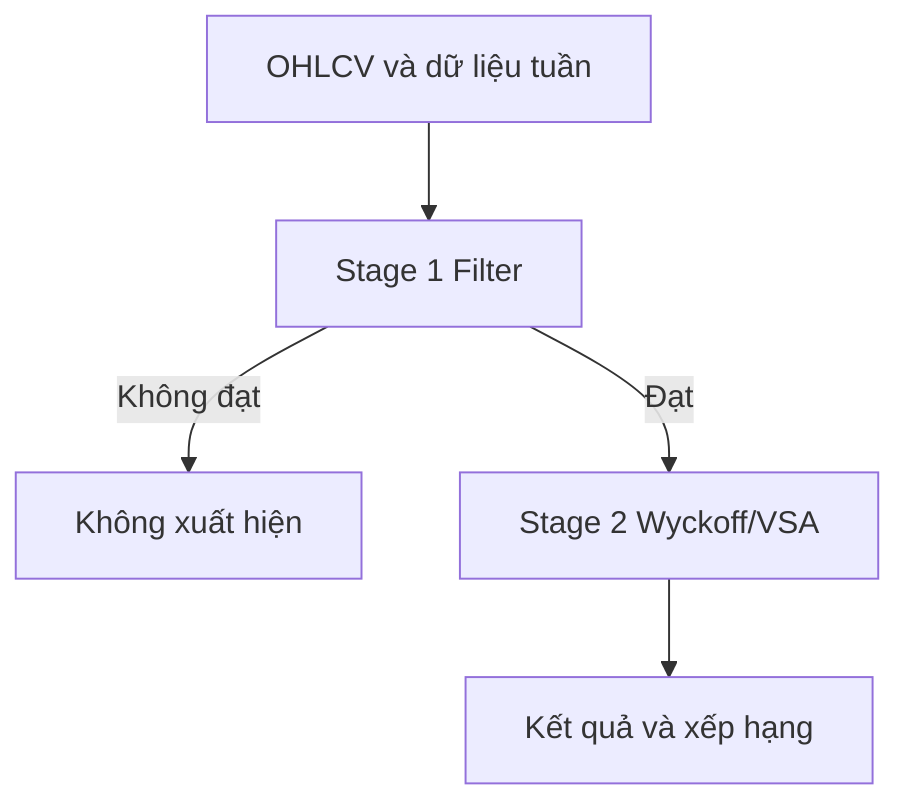
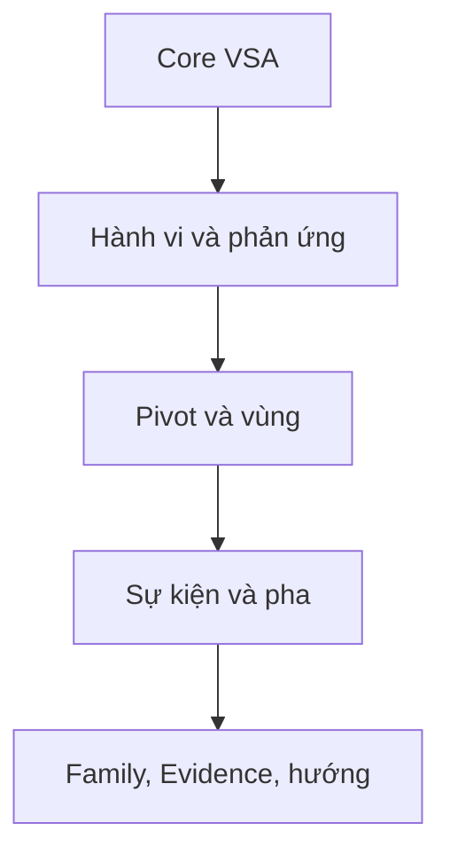
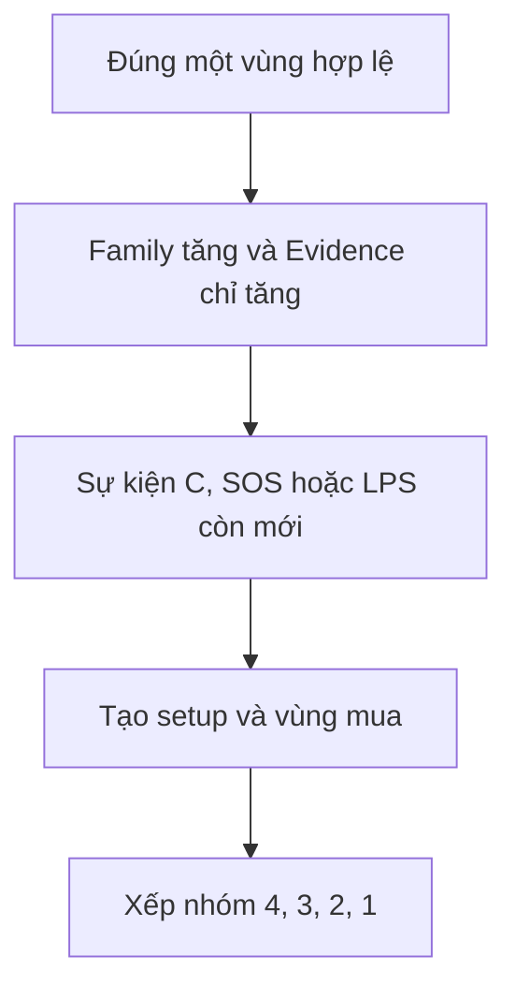
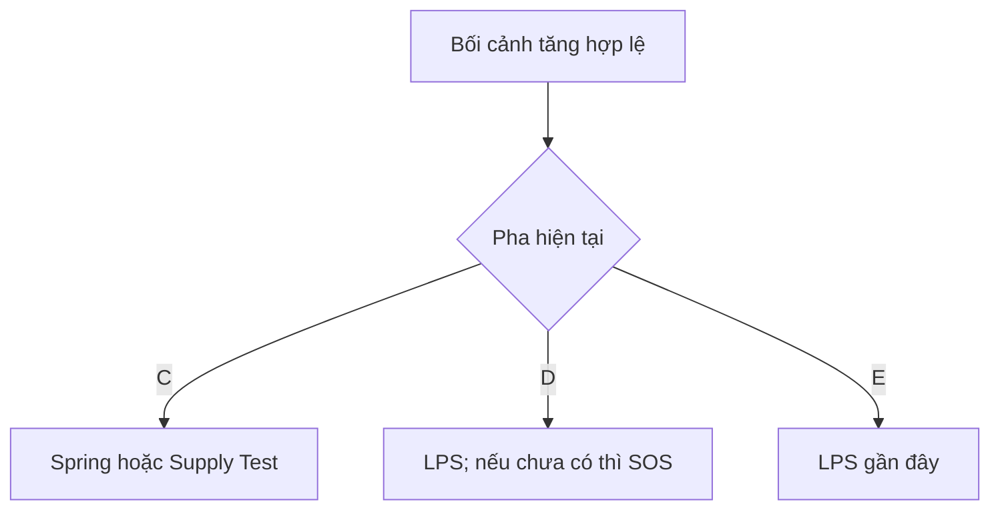
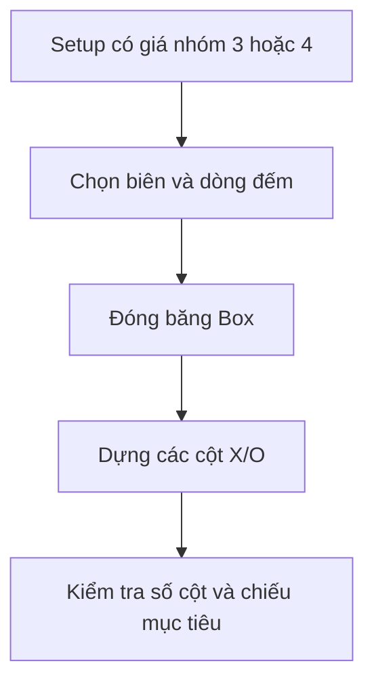
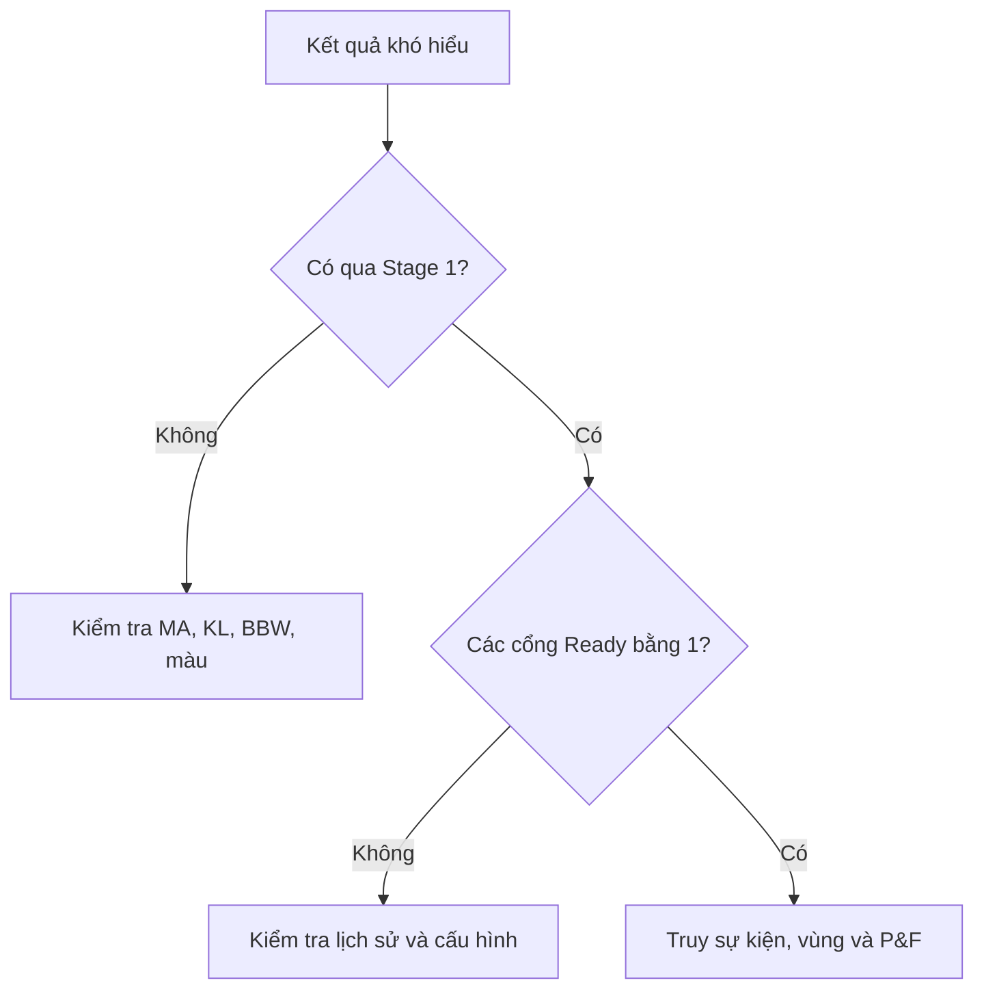

# Sơ đồ nguồn → kết quả

## 1. Kiến trúc hai Stage

Stage 1 là quyền chọn mã duy nhất. Stage 2 không được thêm hoặc loại mã.

## 2. Chuỗi phân tích Stage 2

| Tầng | Đầu vào chính | Đầu ra chính |
|---|---|---|
| Core VSA | Volume, spread, Close, ATR | RVOL, RSpread, Close Position, progress |
| Hành vi | Core VSA + thanh trước/sau | No Demand/Supply, climax, absorption, stopping |
| Cấu trúc | Pivot + hành vi + cửa sổ range | cận vùng, tuổi, phía hình thành |
| Sự kiện | vùng + hành vi + phản ứng | Spring, Test, UT, SOS/LPS, SOW/LPSY |
| Tổng hợp | chuỗi sự kiện | pha, Family, Evidence, hướng |

## 3. Từ cấu trúc đến vùng mua

Nếu bất kỳ cổng nào không đạt, `Cơ hội mua = KHONG DE XUAT` và trạng thái giá là nhóm 0.

## 4. Nhánh setup

Thứ tự ưu tiên setup trong mã: Phase C; Phase D LPS; Phase D SOS; Phase E LPS theo điều kiện pha tương ứng. Một dòng chỉ nhận một mã setup cuối.

## 5. Từ setup đến P&F

| Setup | Biên phải | Trạng thái P&F ban đầu |
|---|---|---|
| Phase C Spring/Test | thanh hiện tại | Tạm tính — Phase C |
| Phase D sau SOS, chưa LPS | thanh hiện tại | Tạm tính — chờ LPS |
| Phase D/E có LPS | thanh gốc LPS | Đã khóa tại LPS |

## 6. Sơ đồ truy lỗi

## 7. Cột nên mở theo câu hỏi

| Câu hỏi | Chế độ / cột |
|---|---|
| Vì sao mã lọt danh sách? | Tóm tắt 6, 10–16; Phân tích 40–45 |
| Vì sao VSA cho nỗ lực/kết quả này? | 7–8, 17–20, 46–49 |
| Bằng chứng tăng/giảm đến từ đâu? | 50–63 và 70–80 |
| Vì sao chọn vùng này? | 64–69; cần sâu hơn dùng Đầy đủ 45–87 |
| Vì sao là Phase C/D/E? | 70–82 |
| Vì sao không có vùng mua? | 21–29 và 64–82 |
| Vì sao không có mục tiêu P&F? | 34–39 và 83–87 |

